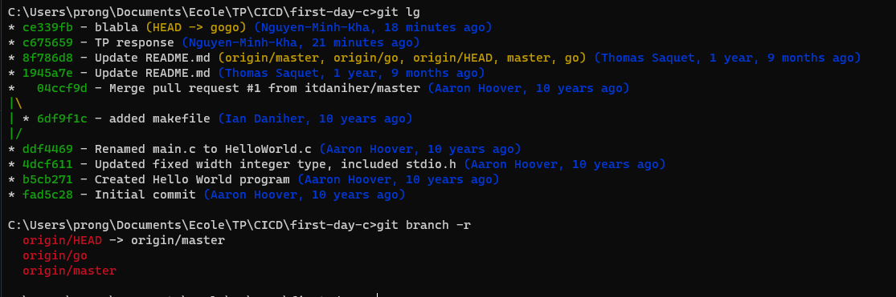

1. git branch

2. git branch -r
> on remarque qu'on est sur le HEAD ainsi le master

3. 
```bash 
git branch go
git checkout go
git push origin go
```

4. 
> on est sur la branche go

5. 
`git checkout go`

6. 
`git branch`

7.
`git checkout master`

8. 
`git checkout -b gogo`


10.
`git status`

11.
> le fichier est untracked

12.
`git add <filename>`

13.
> "changes to be committed"

14.
`git commit -m "commit message"`

15.
> nothing to commit, working tree clean

16. 
> changes not staged to commit, Untracked files

19.
> on a ajouté le changement de l'ancien fichier dans le stage et commit, mais pas le nouveau fichier, donc on attend à ajouter le nouveau fichier dans le stage

22.
`git log`

25.


le git log montre tout les changement du projet

